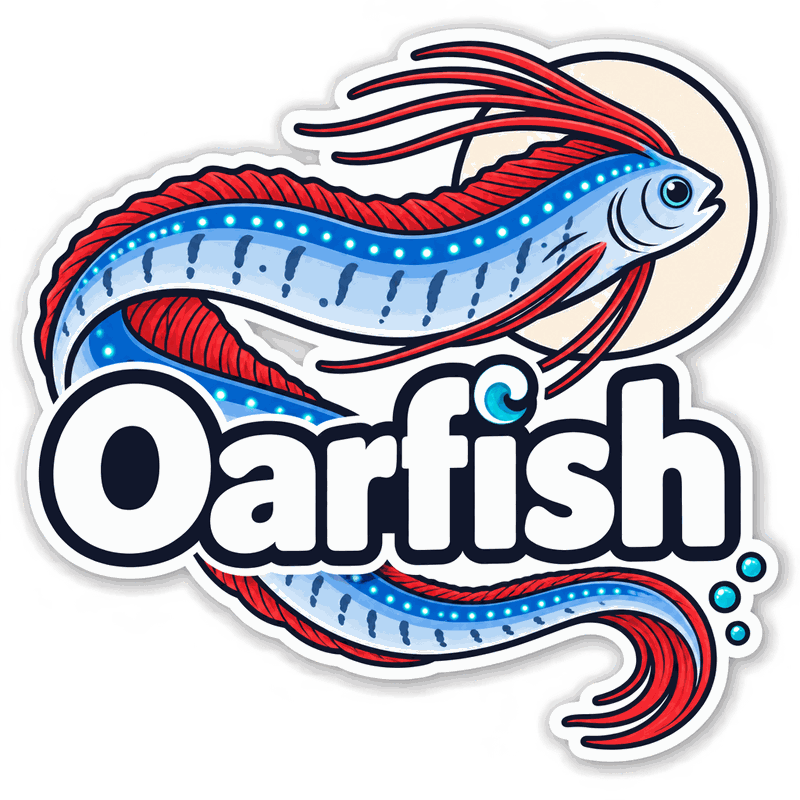

<div align="center">



# 🐟 oarfish

**Log-driven alarms for homelabs, with a judgment model where the guesswork used to be.**

[](https://github.com/Toby-Faucher/oarfish/actions/workflows/ci.yml)
[](LICENSE)
[](rust-toolchain.toml)
[](#status)

*Oarfish live in deep water and are almost never seen. Folklore says they surface to warn of earthquakes.*

</div>

---

## Status

**Pre-alpha.** The pipeline runs end to end: syslog, journald and OTLP intake,
masking, Drain clustering, Jev verdicts cached in fjall, windowing, the alarm state
machine, and SSE to the board, which renders live alarms with forensics. What remains
is **M6** — the board hardened on live data, plus ntfy delivery.

---

## Contents

- [Why](#why)
- [The board](#the-board)
- [How it works](#how-it-works)
- [Quick start](#quick-start)
- [Configuration](#configuration)
- [Project layout](#project-layout)
- [Roadmap](#roadmap)
- [Contributing](#contributing)
- [Acknowledgements](#acknowledgements)
- [License](#license)

---

## Why

Every tool in this space is named for the noise — watching, alerting, uptime.

Oarfish is built for the opposite goal: **it exists so you don't get woken up.**

The failure mode of homelab monitoring isn't missing an outage. It's the 400
notifications a week that trained you to swipe them away, so that the one that
mattered got swiped away too. Threshold rules can't fix that, because the problem
isn't the threshold — it's that nothing in the stack knows what a log line *means*.

Oarfish clusters your logs into a small, stable set of templates, has a decision
model judge each template **once**, and caches that judgment forever. The hot path
never thinks. The model is consulted a few times a day.

---

## The board

The web UI isn't a bolt-on — it's the primary way you use oarfish. A server-rendered
Astro shell with one live island, fed by the daemon's SSE stream. Correct on first
paint, live after that, and it ships almost no JavaScript.

> **Screenshot pending** — the board is next up on the roadmap.

What it shows, per alarm:

- **Why it fired** — the model's full probability distribution, not just a label
- **The template** — with masked variables highlighted
- **The raw lines** — verbatim, always. At 3am you want the bytes that arrived.
- **Decision record** — replay the exact state and questions that produced the verdict
- **"Not an alarm"** — a correction keyed to the template, so tuning happens against
  your lab instead of a benchmark

### Frontend stack

| | |
|---|---|
| **Astro 7** | server-rendered shell, islands architecture, bun for everything |
| **Svelte 5** | the islands — compiles most of its runtime away |
| **Tailwind 4** | CSS-first tokens, no config file |
| **bits-ui** | headless behaviour (menus, dialogs, tooltips) — no visual opinion |
| **Barlow + JetBrains Mono** | self-hosted via Fontsource, no runtime font dependency |
| **@lucide/svelte** | icons |
| **@tanstack/svelte-virtual** | the alarm list |
| **@tanstack/svelte-table** | the templates view only — an alarm list is not a grid |
| **uplot** | sparklines, ~45kB and very fast on time series |

The rule that keeps it light: **a component only gets a `client:` directive if it
genuinely needs to run in the browser.** Without one it still renders — as static
HTML, shipping no JavaScript at all.

### How it looks, and why

UniFi-flavoured: icon rail, dark ground, panels barely lifted off it, one blue accent
used **only** for interaction.

Three decisions worth knowing about:

- **Severity is never colour alone.** It carries bar count, text label and hue at once.
  The hues come from the [Wong palette](https://www.nature.com/articles/nmeth.1618) —
  the usual red-to-green ramp is the single worst pair for colour blindness, and around
  8% of men can't read it.
- **The ground is never `#000`.** Pure black causes halation and destroys any sense of
  elevation; depth comes from stepping each surface ~4% lighter than its parent.
- **Two things animate.** An alarm arriving, and a severity escalating. Everything else
  changes colour in 120ms and otherwise holds still, because this board gets stared at
  for hours.

The one place the design is allowed to be loud is the template renderer, which draws a
masked template as a dimensioned schematic part — the variable slots are measured slots,
and the dimension lines beneath say what each one matched and how often.

---

## How it works

Work is priced by how often it runs, so the pipeline separates three rates:

```
ONCE · at install
   └─ an LLM writes the regex mask bundle ─────────┐
                                                   │
EVERY LINE · pure Rust · no network                ▼
   intake ─→ normalize ─→ mask ─→ Drain ─→ window ─→ alarm engine ─→ SSE + ntfy
                                    │         │
                               cache miss  only if flagged
                                    ▼         ▼
PER NEW TEMPLATE · cached forever   Jev       Jev
                                  verdict   "matters now?"
```

| Rate | What runs | Cached against |
|---|---|---|
| Once, at install | LLM synthesizes the regex mask bundle | `bundle_hash` |
| Per new template | Static verdict — kind, severity, actionable | `TemplateId` |
| Per close pair | Merge review — are these the same event? | `(id_a, id_b)` |
| Per burst, flagged only | Contextual check — does this matter *now*? | not cached |
| **Every line** | mask → cluster → window → alarm engine | pure Rust |

Log volume is enormous; *distinct template* volume is tiny and converges fast. A busy
lab might push millions of lines a day and settle at a few thousand templates, with a
dozen genuinely new ones daily. Key the verdict by template id and steady-state model
spend collapses to fractions of a cent per day.

### Why not just ask an LLM about each log line?

Because that costs thousands of dollars and seconds of latency per decision. Oarfish
uses [Jev](https://typesafe.ai), a System One model that returns **typed decisions with
calibrated confidence** in 70–500ms and cannot emit free text. Confidence picks the
lane, and the threshold scales with the stakes — waking someone needs more certainty
than drawing a card on a dashboard.

### Why not use Drain's own variable detection?

Because it's the accuracy bottleneck. Drain guesses "a token containing a digit is a
variable," which over-masks version numbers and under-masks odd identifiers.
[DeepParse](https://arxiv.org/html/2604.20553v1) showed that moving mask synthesis to a
one-time offline LLM pass lifts parsing accuracy dramatically and cuts downstream false
alarms. Oarfish does that at install and never pays for it again.

---

## Quick start

**Requirements:** Rust 1.98+ (pinned in `rust-toolchain.toml`) and [bun](https://bun.sh).

```sh
git clone https://github.com/Toby-Faucher/oarfish
cd oarfish

# daemon
cargo check --workspace

# board
cd web && bun install && bun run dev
```

The board expects the daemon on `:4000`; `bun run dev` proxies `/api` there.

A TypeSafe API key is optional. Without one the pipeline still runs end to end —
it just stops knowing what anything means.

---

## Configuration

Copy `.env.example` to `.env`:

```sh
OPENROUTER_API_KEY=        # https://openrouter.ai/settings/keys
OARFISH_NTFY_URL=          # e.g. https://ntfy.sh/your-topic
```

---

## Project layout

```
crates/
  oarfish-core     domain types; depends on nothing else in the workspace
  oarfish-mask     applies the regex mask bundle
  oarfish-drain    Drain port — stable template ids
  oarfish-jev      TypeSafe System One client (transport only, no policy)
  oarfish-store    fjall persistence: verdicts, alarms, decision records
  oarfish-ingest   OTLP + syslog + systemd journal
  oarfish-engine   windows, the two Jev passes, alarm state machine
  oarfish-api      JSON API + SSE stream + static hosting
  oarfish          the daemon and its CLI (wiring only)
web/               the board — Astro 7 + Svelte 5 islands, Tailwind 4, bun
docs/specs/        design documents
```

Two invariants worth knowing before you touch anything:

1. **`oarfish-core` depends on nothing else in the workspace.** A cycle there is a
   cycle everywhere.
2. **Nothing on the every-line path makes a network call.** If you find yourself
   adding one, the work belongs on a cached path instead.

---

## Roadmap

Milestones and their acceptance criteria are specified in
[`docs/specs/2026-09-17-oarfish-design.md`](docs/specs/2026-09-17-oarfish-design.md).

- [x] Workspace scaffold, CI, licensing
- [x] Design system and the board shell
- [x] **M0** — `oarfish-core` types, exported to the board via `ts-rs`
- [x] **M1** — mask bundle format + curated default bundle
- [x] **M2** — Drain port, validated against drain3 on a shared corpus
- [x] **M3** — ingest: syslog → journald → OTLP
- [x] **M4** — Jev client + fjall store, with decision records
- [x] **M5** — window, alarm state machine, SSE
- [x] **M5.5** — merge review + the contextual check (`wake_someone`)
- [ ] **M6** — the board on live data, ntfy delivery

`oarfish masks synthesize` (design: `docs/specs/2026-09-19-mask-synthesis-design.md`)
augments the curated bundle with an LLM call at install time, run manually.

---

## Contributing

Issues and PRs welcome, though the API is going to move under you until there's a
tagged release. CI runs `cargo fmt --check`, `cargo clippy -D warnings`, `cargo test`,
and an Astro build — run those locally before opening a PR.

---

## Acknowledgements

- **[Drain](https://github.com/logpai/logparser)** — the log template mining algorithm.
  The port follows [Grafana Loki's implementation](https://github.com/grafana/loki/tree/main/pkg/pattern/drain),
  which ships the operational pieces drain3 lacks.
- **[DeepParse](https://arxiv.org/html/2604.20553v1)** — for the offline mask synthesis idea.
- **[TypeSafe](https://typesafe.ai)** — for Jev and the System One model class,
  reached via [OpenRouter](https://openrouter.ai/typesafe).
- **[ntfy](https://ntfy.sh)** — for being the thing that actually reaches the phone.
- **[tokio](https://tokio.rs)** — and `tokio-util`, whose `DelayQueue` runs every
  alarm timer and whose codecs frame every syslog connection.

---

## License

[MIT](LICENSE) © Toby Faucher
